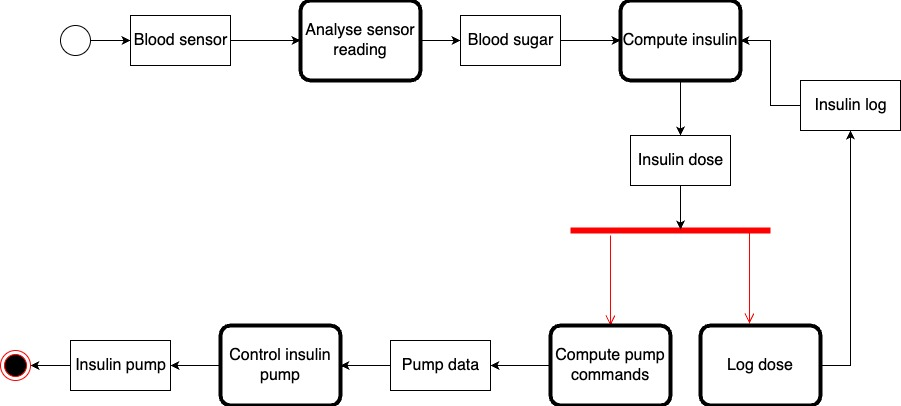

# Insulin Pump Case Study - cited from Ian Sommerville Software Engineering, Tenth Edition 

https://software-engineering-book.com/case-studies/
This case study is part of the Open Design Case Study project. This work is licensed under the Creative Commons Attribution-NonCommercial 3.0 ([CC BY-NC 3.0](https://creativecommons.org/licenses/by-nc/3.0/us/)) United States License.

### Citation

Sommerville, I. (2016) Software Engineering. 10th Edition, Pearson Education Limited, Boston.

### Title

A personal software controlled insulin pump

### Objectives

This case study discusses the control software for a personal insulin pump, which is used by diabetics to mimic the function of the pancreas and hence control the level of glucose (sugar) in their blood. The level of blood sugar depends on what the system user has eaten, the speed of their digestive processes and the effectiveness of their body in metabolising blood sugar. Therefore, their is not a simple relationship between a blood sugar measurement and the amount of insulin to be injected. Rather, the control system has to make several measurements and assess the rate of change of blood sugar. Based on the current level and the rate and direction of change, the incremental amount of insulin to be injected is computed and injected using the micro-pump in the system. This is a safety-critical system as failure to inject the correct amount of insulin can have serious health consequences.

### Stakeholder

- User (diabetic patient)
- Doctors (indirect user)
- Caregiver (indirect user)
- Nurses (indirect user)

### Requirements

#### Description

1. Using readings from an embedded sensor, the system automatically measures the level of glucose in the users' body
2. Consecutive readings are compared and, if they indicate that the level of glucose is rising, then insulin is injected to conteract this rise
3. The ideal situation is a consistent level of sugar that is within some "safe" band
4. Sugar levels can be categorized as "unsafe", "safe", and "undeseriable" where different amount of insulin will be injected (or not injected) to the users.

Detailed requirements can be found [here](https://www.dropbox.com/s/grgaaxtdas4oj1i/InsulinPumpRequirements.pdf?dl=0)

#### Constraints

1. The system shall be available to deliver insulin when required
2. The system shall perform reliably and deliver the correct amount of insulin to counteract the current level of sugar.
3. If error condition occurs, alarm will be shown to the users based on the constraints stated in the detailed requirement specification

#### Quality Attributes

1. Reliability -  
(a) can inject the correct amount of dosage all the time (safety-critical)
(b) must monitor blood sugar level at fixed intervals
(c) if error occurs, must notify the users with the designated alarm condition
(d) intermittent demand for service are made on the system

2. Availability - 
the pump should have a high level of availability but the nature of the diabetes is such that continous availability is unnecessary 

3. Safety -
The key safety requirements are that the operation of the system should never result in a very low level of blood sugar.

### Environment

#### Entities and Assumptions

| Entities  | Assumptions  |
|---|---|
|  Blood parameter sensor | Micro-sensor embedded in the patient to measure some blood parameters that is proportional to the sugar level |
| Alarm | Display relevant alarm condition depending on the failure detected |
| Pump  | Insulin pump in charge of delivering the desired amount of insulin |
| Controller | Contain the logic to calculate the desired level of insulin needed for the patient, depending on their blood sugar readings |

### Design Solution

**Architecture Model (hardware)**

**Activity Diagram of the insulin pump**

### Teaching Materials

#### Suggested Usage

1. The author use this case study to discuss general issues of safety and safety-critical systems. It is used in discussing issues of dependability specification and the use of formal specification techniques in dependable system engineering. Formal specification is especially valuable for this system as the computation to calculate the amount of insulin required is detailed and complex and quite difficult to specify using natural language. The formal specification in the Z notation is provided. 

2. In lectures on dependability assurance, the author use examples from the insulin pump system to illustrate safety arguments and safety cases. Users of this case study can use the example more generally in lectures on requirements engineering, system modeling and embedded systems.				

### Other notes and resources

- [Overview of a software controller insulin pump](https://www.dropbox.com/s/tzc8shdjmrqo4cz/InsulinPumpOverview.pdf?dl=0)
- [System overview slides](http://www.slideshare.net/software-engineering-book/insulin-pump-overview)
- [Insulin Pump Requirements Specification](https://www.dropbox.com/s/grgaaxtdas4oj1i/InsulinPumpRequirements.pdf?dl=0)
- [Insulin Pump Z Schema](https://www.dropbox.com/s/gmswnees66p0r3x/Insulin%20Pump%20Z%20schemas.pdf?dl=0)
